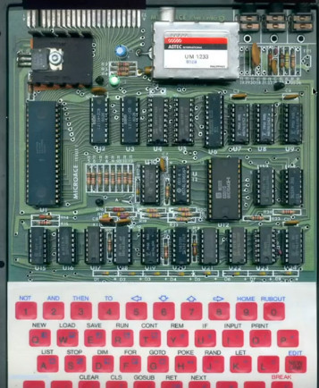
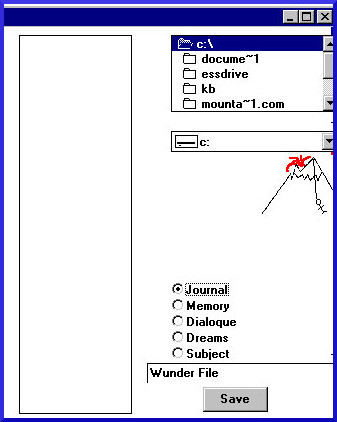
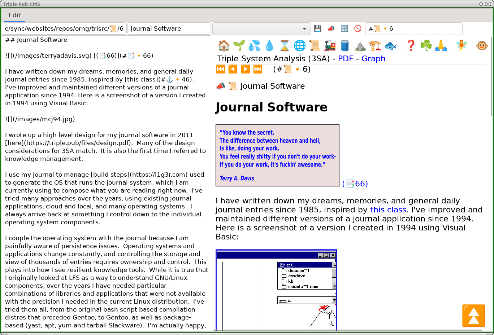

# Code and Demonstrations

This code supports my work with [Triple System Analysis](https://triple.pub), which has been my primary focus for several years.

## Triple Console

Demonstration of Plotly Dash console that visualizes and modifies data flow graphs in real-time.  It uses an emoji notation, so it can easily be modified for other domains.  I'm using connection rules for Gane and Sarson notation.  Note that most graph utilities attempt to build graphs at the node level visually; however, this can be cumbersome, as locating the nodes on the graph quickly, for even medium sized graphs, takes a bit of visual scanning by participants.  Data flow forms a fairly constrained graph, so their are many advantages to  creating a custom UI for editing the graph.

### Code

[github.io/triple_console/](https://github.com/scott-h-system-analyst/scott-h-system-analyst.github.io/tree/main/triple_console)

### Demonstration Video

<a href="https://youtu.be/U8ZtJ-kr_2o" title="Triple Console">Click for full vid on YouTube</a>

## Graph Grow

Demonstration of local-first graph collaboration utilizing Plotly Dash. 

### Code

[github.io/tree/main/graph_grow_mqtt](https://github.com/scott-h-system-analyst/scott-h-system-analyst.github.io/tree/main/graph_grow_mqtt)  

### Demonstration Video

 
<a href="https://youtu.be/etJ6HB0Rmps" title="Graph Grow">Graph Grow on YouTube</a>

## Keys Stream wxPython

Demonstration of signed triples in streams using wxPython for the UI, MQTT, and a Sqlite database for storage and replay of the streams.  This includes a graph editor in pure Python using the wxPython framework rather than using Dash and React components.

### Code
[github.io/tree/main/keys_stream_wxpython](https://github.com/scott-h-system-analyst/scott-h-system-analyst.github.io/tree/main/keys_stream_wxpython) 

### Demonstration Videos

{width=50em}

 
<a href="/images/pyedt.gif" title="wxPython Graph Editor">Click for full size</a>

 
 
 {width=50em}

 
<a href="/images/streamgr.gif" title="Stream Graph">Click for full size</a>

# About Me

(... or, how I got the Triple System Analysis bug, and lived to tell about it.)

## Related Work History

I started my IT career as a computer salesperson of personal computers: IBM PCs/Compatibles, CP/M-80, and the odd [Sage with UCSD p-System OS](http://www.thebattles.net/sage/).  Prior to PCs, information processing systems required many people to operate and maintain them, as well as reliance on large corporations that often owned the hardware, leasing the systems to users.  With PCs, organizations could scale and operate with agency.  A typical sale involved business and system analysis.  A customer would have a problem they needed to solve, and the sale would revolve around that problem.  I would often go onsite after the sale to help bring the system operational within their organization.  I remember needing to use a hex editor on a WordStar word processing binary file to match superscript/subscript commands for a customer's printer.  I helped with a successful political campaign by selling a politician a PC and helping her load and configure her database for mailings.  She won her state representative campaign, and later went on to become a member of the US House of Representatives.  These experiences stayed with me, ingrained as both as an illustration of the benefit of information technology, but also let me see a time of revolution, when stakeholders had technological and operational agency.  Apple Computer [was also tuned in](https://youtu.be/VtvjbmoDx-I) to this revolution.  Who would have imagined that we would eventually cede that agency to a handful of apex cloud corporations, after winning the revolution from corporate-controlled compute once?  Even routine office applications, the staple applications of spreadsheets, databases, and word processing, have moved to cloud.  The handful of apex cloud companies require many other cloud companies to operate. Connectivity is also required to these cloud providers.  Now, individuals and organizations don't just depend on one company that leases and supports their information systems, they depend on an entire web of dependencies on other companies for their lifeblood.   I watched and participated in the entire transition, and understand the reasons; however, I have never lost the memory of that excitement and freedom when users brought compute home.

I spent a total of five years selling personal computers, and got a degree in math.  My career moved on to enterprise IT with the widespread adoption of networking in 1994.  I got a job at an IT consulting firm as a technician and helpdesk for the main and satellite office.  This single company morphed through an initial joining of four founding companies across six cities, into a nation-wide consulting company in 25 cities.   I developed my own early form of DevOps to assist with this.  I would ask managers at the acquired companies to fill out a spreadsheet of applications, users, shares, and permissions, and I would feed that into a Perl script that would configure NT servers (BDC and PDC) for each location.  

The complexity of the resulting system required automation and third party software to manage. I learned an early enterprise IT system management platform, Unicenter TNG, but added my own automation, as the GUI was cumbersome.

<a href="/images/unidiag.svg">Click here for larger version.</a>

As we acquired companies, IT operations and engineering was directed to push expenditures into the cost of acquisitions.   Combined with "goodwill", I saw how acquisitions could create a seemingly healthy company, yet there was no real operational agency or strategy that unified the acquired companies for healthy profit.  I confronted our accountant about this in a diplomatic way, and she said, "You aren't supposed to know about that."  Upper management felt that they could gain control of the monolith they had built with enough business intelligence (BI), so they put in [Cognos](https://web.archive.org/web/20000816080519/http://www.cognos.com/about/).    On their own, the leaders who had built the successful individual consulting companies understood how they ran, and what they were all doing together.  The combined roll-up, particularly with the accounting strategy of acquisitions, caused a crippling cognitive dissonance for shared intention and overall health.  This was my first glimpse of [black box BI](https://youtu.be/f9g4-5-GKBc) used to mitigate lack of human cognition.  Human cognition should come first.  What are our strengths?  What do we have to offer the world that is unique?  How do we gauge success?  Once these broader questions are answered, BI can be used to ensure the organization is tracking to intent.  The roll-up failed, tried to re-invent itself, and sold for a decent sum.  I was laid off, and was one of the last ones shutting down the datacenter.

In 2001, I got a job working for a startup that provided inventory management and combined purchasing for health food stores.  Most of the stores were connected with dial-up lines.  With a crew of three, I deployed and managed 150 stores with POS/PC systems, centrally updated inventory databases and frequently changing software at the stores, including Palm OS devices that handled the scanning.  This, combined with the Unicenter TNG work I had done previously, gave me a decent insight into the coming DevOps perspective that infrastructure was code.

{width=50em}

<a href="/images/esystem.png">Click here for larger version.</a>

Folks, this was nightly CI/CD to 150 stores over dial-up lines.

When the company got tight on money, it used the float from the store purchases for operations.  This has a similar kind of problem as rolling operational costs into acquisitions.  Everything is great as long as you are expanding, but a lull can be devastating.

I then got a job in 2003 for a medical ASP (ASP=Application Service Provider. It is what they called cloud before it became SaaS).  In addition to building out and monitoring the front-end servers, I worked on their remit downloads, verification, and processing.  While there, I created my first data flow, documenting my work.  I used the same diagramming tools I used for my [Z-80 homebrew](#homebrew-computer) schematic.

{width=50em}

<a href="/images/remit.svg">Click here for larger version.</a>

Like the previous two jobs, this company failed as well; however, it failed because of technical reasons.  There was a misconfigured cross-connect between switches that caused performance problems.  I count this as one of my bigger failures in my career.  While I was not part of the networking team (of two), the pool of servers I designed, built, and operated, ran across multiple switches.  Eventually I was able to figure out the problem after the main network engineer left; however, it took way too long, and we had lost most of our business by then.  I should have been more active in troubleshooting the issues.  My lack of engagement across silos was arguably the reason for the failure of the company.  What is very interesting about this, is that all of the silo groups (networking, apps, compute, storage, database) had lots of real-time reporting of the systems.  I had several myself.  I even put in [SmokePing](https://web.archive.org/web/20230218193443/https://oss.oetiker.ch/smokeping/demo.png) and created other network testing tools that measured TCP latency to my servers (vs. just ICMP).  None of our reporting got to the root problem.  Not once did we all got together in a room and discuss all of the pieces together to try and brainstorm a solution. There were many conference calls, which impressed on me that in-person brainstorming is better.  Instead of true collaboration, we just created lots and lots of reporting that tended to show why the problem wasn't within our silo.

In 2006 I got a job as a system architect at a global law firm.  Within the first two weeks of my job at the firm, I jumped right in to a critical project.  They were trying to solve the problem of running discovery apps over latent links.  They also had a horrible network that aggravated this, but they weren't aware of just how bad it was, and wanted to buy an app to solve a particular symptom.  The CIO set up a meeting, and I met along with my assigned project manager to establish the timeline for rollout on my first week on the job.  The CIO put me on the spot, and I figured no big deal, I would figure out how it worked, what people needed the first week, get the vendor recommendations, and put it in by week two.  My project manager, who was previously a project manager that worked at NASA on the space shuttle, was not happy that I had answered in this way.  I told her I would back it up, and responded with a two paragraph email that had bullet points for how I saw the project being implemented.  She came back, waving the email at me, and said that what I gave her was entirely unacceptable.  I was confused and thought she was abusing me (she wasn't).

I went to my boss, a wonderful boss that was generous and thought broadly. She gave me an example of what was needed.  This is how I was introduced to the concept of a solution design document.  It is a form of knowledge that describes where we are now and where we want to be in standard terms, so that everybody can agree.  Not every aspect needed to be filled out.  It varied by solution.  In the years that followed, I realized that if the information applied to a system at all, at some point during the procurement, deployment, or operation of the system, the aspects would come up.  From that time forward, I insisted on creating an appropriately scaled solution description for every medium+ project I worked on.   My work experience so far showed the value of this level of detail.  My insistence on solution description documentation, though, was increasingly received poorly over time.  It was perceived as a drag on "agility".

I moved on to a technical project manager role, where I moved a point of sale system to cloud for a brick and mortar retailer, and moved on again to a pioneer of internet search that was re-inventing itself after losing the search wars to the current apex cloud search engine.  I was in charge of all monitoring.  There was a brilliant person in charge of IT that had replaced the typical relational database reporting with decomposed data that was then fed into reporting and analysis engines, kind of like the modern Elastic.  I realized that key-value pairs in event streams could be much more effectively analyzed than canned relational reports.  This is the idea of Splunk and I evangelized Splunk.  I also struggled with the simplest tasks of reporting on all monitors across thousands of servers.   Nodes in a monitoring system do not fit well into a relational database.  Most machines are different, even if they are the same model.  I found that  NoSQL approaches worked better for reporting on monitor classes.

At this point, 2011, I have in my kit: streams via key-value pairs and analysis via Splunk, knowledge management, formal solution description/design documents, graphs for resilience (homebrew) and graphs for reporting (monitors) 

I was hot on the key-value pair stream analysis track.  I moved on to another startup, where I could do anything I wanted in IT as long as it was fast enough and fit the requirements of the money that backed us (large banks).  I struggled with my main developer to build out an analysis platform for an upcoming launch.  I finally just did it all myself in two weeks using GNU/Linux, BASH, Perl to capture and normalize the data, and ran it all into Splunk as key-value pairs, happily proving my ideas from my previous job.  I used my skills in system documentation to demonstrate to the banks our systems were secure and protected.  This company also failed because of lack of funding.

I moved on to another law firm, which had a similar cycle of projects that my solution design skills worked well for; however, there are some cracks starting to show.  There was no longer an architecture team, and the meaning of engineering and design had degraded to quick vendor meetings and a few notes.  I remember one design consideration that I focused on that was particularly difficult for people to grok.  Backup retention was complicated at a law firm because of discovery.  If email and deleted files were only retained for 30 days, then discovery was easier to comply with.  The cognitive ability for somebody to include backup retention from a discovery perspective, backup retention from a critical files perspective, and off-site replication and storage, was stretched so far, that additional questions about backup retention of critical files were quickly brushed off as already dealt with.  The scenario I was focused on was if data is corrupted or purposefully deleted and not discovered until after 30 days.  Certainly there are important files at a law firm where this needed to be addressed, but the collapse of the architecture-&gt;engineering-&gt;operations roles was coming down on my head as I struggled.  I met over ten times over the course of a year to get a proper backup retention policy in place.  I finally got the operations team to put in a fix; however, they couldn't figure out how to make it permanent for more than a year, and I had to set a yearly notice on my calendar to remind them to put in the the one-off interval backup.  This also means that the only files in the entire global law firm, at that time, that were backed up outside of the 30 day retention policy, were my files that I had specifically adjusted for.  I had no indication that after all of this fight, that it had sunk in that we needed a broader policy to cover other files, and I had used up more than my allotted attention fighting for this one backup design requirement aspect.  This experience inspired me to figure out how to break down requirements and design considerations in ways that stakeholders could understand.  As an analyst, the problem is my problem, not the stakeholders&rsquo;.

In addition to the increasing cognitive challenges for operations folks trying to shepherd design considerations, the level of documentation, even in its simplest form, was too much for most people to understand.  I think that the worst part was the long narrative form.  Work and associated design knowledge was being broken down while I was building my analysis and collaboration skills up.  More and more I would find that even engineering managers could only digest a couple sentences.  There was a perception by management that long-form analysis documents were part of the old world.  The new world was agile. When network, security, storage, and OS dependencies are stripped away, i.e. all that remains are containers and cloud services, the scope gets narrow enough that the developers can just write the app, show it to users, and in a tightly coupled loop deliver and improve products without much engineering or architecture.  I imagine that most who are in IT and are tracking my story here, would recognize that agile doesn't necessarily have anything to do with design and architecture, but we are back to human cognition.  The perceived freedom of agile is that there is constant progress, but in practice it comes from sacrificing system cognition by the humans participating in the agile workstreams.  There are plenty of cattle. [Pets are too expensive](https://cloudscaling.com/blog/cloud-computing/the-history-of-pets-vs-cattle/).  Just rely on the cloud company to supply the feedlots and slaughterhouses.

One project, though, changed my life again, just as significantly as the NASA project manager did at the previous law firm.  I was put on a project to  convert the public finance group from paper workflow to electronic.

I needed something that captured the system in an abstract way that could be reviewed with the group.  The default Visio model that looked best was Gane and Sarson.  It had three symbols. It made more sense than UML.  More importantly, it solved the biggest problem I had so far: an easy and understandable way to provide levels of different detail.  Gane and Sarson is a data flow model (DFD).  Information Technology, at root, deals with data flow.  There are many other perspectives that formal enterprise architecture frameworks capture, but data flow is the lowest common denominator.  I used it to analyze several systems since, at full detail, and it is quite flexible, particularly with some of the constraints and conventions I have added.

In 2018 I moved on to a company that offered wellness programs and coaching to employers.   We had an outsourced engineering and design team, located overseas, with product management handled locally.  I was meant to bridge that gap.   Much of the business workflow was spread through a cloud service that cost a lot of money, and there was a desire to untangle the systems from this service.  The workflow was coded over time by many people, and it touched every aspect of their business.  It was not documented.  It was a perfect candidate for a DFD.  I created a system-wide DFD.  Upper management and stakeholders found the method helpful, but the problem was that it was difficult to match the velocity of the product and engineering teams.  I did some research on how to increase velocity, found that triples could help, and pitched it to the company, but they said my ideas were too advanced for them, and in 2019 I was laid off.  I have worked on the ideas on my own since then.

## Personal Interests

### Wrenching

My wrenching over the years is related to my perspective on complicated systems, failure, and resilience.  

Here I am removing the engine from a 1963 Rambler American in 2005:

In the background there is a chicken tractor that had a Busybox/Linux system I compiled mounted in the top. 

You can see I've fashioned a dust filter and duct-taped it to the cooling intake.  It had a camera that automatically posted regular pictures of the chickens on the world wide web.

Here I am in 1987, fixing the brakes on a 1965 Rambler Station Wagon:

I was young and foolish to not use jack stands; however, I could barely afford the pads, so I'll give myself a little slack, but my-o-my, seeing the car balanced on that bottle jack makes me shake my head and offer advice I likely wouldn't have heeded anyway.  My "toolbox" was that big metal bowl in the foreground.

The technical service manual I had for my 1963 Rambler American was incorrect.  I created a correct diagram for intake and exhaust valves using Xfig, the same program I created my first data flow and my homebrew schematic with:

 

Cars are systems.  They are affected by supply chain issues and general complexity.  Even though the unibody Ramblers with their rust dip would last for decades, the Chrysler acquisition in 1987 hindered the availability of parts.  Working on a Rambler illustrates ideas of system resilience.  Is it simple?  Can it be re-used?  Does one vendor control the distribution of parts via tooling?  Can a human understand it and fix it?  In the end, though, if the parts are throttled, you have to support the cycle of consumption and purchase a different car.  

### Homebrew Computer

In 1980, I purchased a [MicroAce](https://archive.org/details/byte-magazine-1980-11/page/n313/mode/2up).  It was [an unlicensed clone](https://www.timexsinclair.com/computers/microace/) of the Timex/Sinclair computer in kit form. 

I could program in BASIC on it, but I was not satisfied.  I wanted to know more, dig deeper.  I wanted to wire it, know it from roots to leaves, and intentionally author the code that brought it to life.

 {width=50em}

<a href="/images/hb20221.jpg">Click here for larger version</a>

I completed the first breadboard  version of a Z-80 homebrew computer that same year, in 1980.  I mounted a breadboard in the top of a file box, with a keypad and hexadecimal display.  It failed miserably.  I didn't understand the concept of a high-impedance state for the bus, and I thought my construction technique was creating too much noise.    I worked on and off for many years, breadboarding different versions.  It took awhile to finish, with the ups and downs in my life.  I would go for years at a time without working on it, but  I finally completed a working, soldered system in 1992. 

The display in the upper right I soldered first, in 1989.  You can see I'm using old 50 pair telco wire, which isn't the best, because it can melt and cause shorts with other wires when soldering, but I happened to have some at the time.    The lower right board that is connected to the bottom of the case holds 2N2222 drivers for lamps, which you can see in this video:

{width=50em}

<a href="https://youtu.be/XW403M4Bf-Y">Click here to watch with sound.</a>

The video shows me toggling reset. Right after reset, the lamps in the center, to the right, show the streaming data the homebrew is receiving over a PC parallel port.  This is a small bootstrap program that looks for a byte on the parallel port with the correct signal line state, loads it into memory, waits for another state change, loads that byte into memory, repeats until all bytes are loaded, and, finally, jumps back to run the program, which cycles the incandescent lamps and the 7-segment displays.

A bootstrap is usually entered through rows of switches and lights called a front panel.  I couldn't afford a proper front panel, so I used dipswitches and a paperclip interface with NAND gates in a set/reset configuration to debounce and enter data.  Here is what I used to program the bootstrap directly into memory:

{width=50em}

<a href="https://triple.pub/images/hb20222.jpg">Click here for larger version.</a>

The NAND gates are in the electrical tape wrapped handle of the perfboard.   You can see the binary-decimal conversion for the bit locations written in between the paperclips sticking out.

When I first breadboarded this, it started with this hand-drawn diagram:

{width=50em}

<a href="https://triple.pub/images/hborigfull.jpg">Click here for larger version.</a>

As I moved the homebrew around, following jobs and apartments, the solder connections would break, mainly because of bad soldering on my part, in combination with the technical debt of choosing point-to-point solder on perfboard:

I needed a way to document it, and a schematic which doubled as a physical diagram of the pinouts was the most effective reference for troubleshooting.  I spent quite a few staycations looking at something like this:

My hand drawn version worked OK, but I realized that legible hand-drawn lines would be difficult to manage, and finishing the hand-drawn version would likely end in failure.  I tried a variety of diagram programs, but the only one that worked for what I needed, that didn't cost too much, was Xfig.   

[Xfig](https://mcj.sourceforge.net/) only ran on *NIX systems, and was my early motivation to learn GNU/Linux.   Here is what I ended up with, which I didn't finish until 2003:

{width=50em}

<a href="/images/hb2.svg">Click here for vector version.</a>

<a href="/files/homebrew.fig">Click here for schematic in fig format.</a>

Wiring functions like a graph, where the edge is a wire connecting the nodes of two connections.  Or alternatively, a schematic is a wiring map.  The intention is to create a solder joint that won't break, but the reality is that they will, and do, and having a map of pinouts and wires goes miles towards keeping the homebrew running.  My map distinguished  control lines from address and bus with color coding, and curved the lines so they were distinguishable from each other.

I talk a bit about my homebrew and the relation to 3SA [here](https://youtu.be/9wp-_tGGKkc).

### Journal Software

<blockquote>
Those works created from solitude and from pure and authentic creative impulses – where the worries of competition, acclaim and social promotion do not interfere – are, because of these very facts, more precious than the productions of professionals. After a certain familiarity with these flourishings of an exalted feverishness, lived so fully and so intensely by their authors, we cannot avoid the feeling that in relation to these works, cultural art in its entirety appears to be the game of a futile society, a fallacious parade.  ~[Jean Dubuffet](https://sites.google.com/site/artbrutmatscalcoen/jean-dubuffet). </blockquote>

I have written down my dreams, memories, and general daily journal entries since 1985, inspired by [this class](https://web.archive.org/web/20190126184600/http://archives.evergreen.edu/1976/1976-12/sinclair_l/journalexploration.pdf).   I've improved and maintained different versions of a journal application since 1994. Here is a screenshot of a version I created in 1994 using Visual Basic:

More and more, as I survived the increasingly stifling intellectual environment of the places I worked at, I would focus on my journal software in my spare time. 

<a href="https://youtu.be/NA007dhlYyU">Click here for original version.</a>

Consider this collection of videos I created over the course of nine years:

[Install MCJ](https://youtu.be/CZcMDtsJiUs)  
[Tour of MCJ With Rails](https://youtu.be/7-s7Bzk6so4)  
[MCJ Knowledge Management](https://youtu.be/VusxNiaoasM)  
[Create Icons](https://youtu.be/TeKPNRiNfgE)  
[2019 MCJ](https://youtu.be/cjd6zcVBOwY)

It isn't a stretch to draw a comparison with Terry Davis.  I can certainly relate to his focus.  I often feel like I'm doing outsider art.

I wrote up a high level design for my journal software in 2011 [here](/files/design.pdf).  Many of the design considerations for 3SA match.  It is also the first time I referred to knowledge management. 

I use my journal to manage [build steps](https://l1g3r.com) used to generate the OS that runs the journal system, which I am currently using to compose what you are reading right now (still, after all of these years).  I've tried many approaches over the years, using existing journal applications, cloud and local, and many operating systems.  I always arrive back at something I control down to the individual operating system components, and the base has been the [Linux From Scratch](https://www.linuxfromscratch.org/) (LFS) project.

I couple the operating system with the journal because I am painfully aware of persistence issues.  Operating systems and applications change constantly, and controlling the storage and view of thousands of entries requires ownership and control.  This plays into how I see resilient knowledge tools.  While it is true that I originally looked at LFS as a way to understand GNU/Linux components, over the years I have needed particular combinations of libraries and applications that were not available with the precision I needed in the current Linux distribution.  I've tried them all, from the original bash script based compilation distros that preceded Gentoo, to Gentoo, as well as package-based (yast, apt, yum and tarball Slackware).  I'm actually happy, now, with where my journal software is at with wxPython, and Ubuntu 20.04 appears to be capable of doing all that I envision.   I also think that KNOPPIX 9.1 might be able to handle it.  So, eventually I will move to that, is my guess, but when I say that I am conscious of how interconnected and cumbersome the software supply chain is, and even now have a reluctance to move, I say that with significant background.  Even with the extra hours of doing what most people would consider trivial OS tasks, overall I am more productive. 

Here is a screenshot of the current version, written with JavaScript and Python, that I'm using to write the document you are reading:

{width=50em}

[Triple System Analysis](https://triple.pub) (3SA) doesn't tackle the maintenance of triples themselves.  It is a way that I make the design persistent, as it pushes the ideas down to data rather than stopping at processes (software).  Ultimately that is how I'm tackling my own growing collection of journal entries.  In triple form I can create something with any OS.  Further, by decoupling the rendering from the OS and triple creation, I can always read my journal with a modern web browser, or whatever the equivalent is.  The 100 inch wheelbase Nash/AMC Ramblers were built around the  [196 CI engine](#wrenching).  I think of my current journal view in that way.  It is an engine of data, triples, surrounded by a script coach.  Put the horse before the cart, right?

### Energy Transition

In 2011 I joined an energy transition group.  This was at the tail-end of interest in peak oil, as the U.S. fracking industry was changing the urgency and attention around the issue; however, I learned quite a bit about how the calculus of energy use was not as simple as battery-electric vehicles (BEVs).   I learned how extensively oil is used in our civilization.  It goes much further than just plastic.  The peak oil crowd also includes quite a few doomers who warn about our situation with global warming.  It is a strange combination, as concern about peak oil appears to be counter to concern about human-caused climate change due to burning fossil fuels.  The more I dug in, the more interesting it became... and horrifying. My interest in requirements and design was leveraged, as some of the same aspects were important: scalability, manageability, availability, etc.  I realized that most people only understood system issues at a couple of degrees from origin.  For instance, people could understand that BEVs were a good direction, and powering BEVs could come from photovoltaic panels or wind generators, and that they needed batteries, so those needed to be manufactured.  The problem is that modern supply chains are very complex, much like modern software supply chains.  That complexity hides environmental costs.  Additionally, the complexity provides economic benefit if you ignore the environmental costs and other negative externalities, which serves to push us in the wrong direction.  Mostly, at root, the magic of modern civilization comes from cheap oil and cumulative knowledge.  Computers facilitate supply chain efficiency,  scaling and complexity, so in addition to relying on incredibly deep supply chains that cause problems, computers themselves brought us to the precarious situation we face now.  This formed my opinion that the same challenges I had in IT with human cognition were mirrored in broader system issues that affected everybody.  What are we doing now?  Where do we want to be?  How do we get there?  With what kind of compute?  

# Privacy Policy

This website does not collect, store or process any Personally Identifiable Information. This website does not use any cookies.

This website is hosted on GitHub Pages. GitHub may collect User Personal Information as noted here:

<blockquote>

GitHub may collect User Personal Information from visitors to your GitHub Pages website, including logs of visitor IP addresses, to comply with legal obligations, and to maintain the security and integrity of the Website and the Service.  <a href="https://docs.github.com/en/github/site-policy/github-privacy-statement#github-pages">GitHub Privacy Statement &gt; Additional Services &gt; GitHub Pages</a>

</blockquote>
