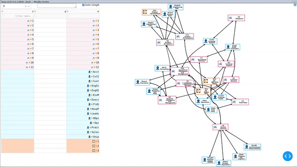

# Triple Console

Demonstration of console to visualize and modify graphs, focused on Gane and Sarson notation with emoji.  Note that most graph utilities attempt to do this at the node level visually; however, this can be cumbersome, as locating the nodes on the graph quickly for even medium sized graphs takes a bit of visual scanning by participants.

## Code

[github.io/triple_console/](https://github.com/scott-h-system-analyst/scott-h-system-analyst.github.io/tree/main/triple_console)

## Video

[Video with discussion and CC on Linkedin](https://www.linkedin.com/posts/scott-h-system-analyst_plotly-dash-localfirst-activity-7036110405613559808-kbp0)

[YouTube](https://youtu.be/U8ZtJ-kr_2o)

# Graph Grow

Demonstration of local-first graph collaboration utilizing Plotly Dash. 

## Code

[github.io/tree/main/graph_grow_mqtt](https://github.com/scott-h-system-analyst/scott-h-system-analyst.github.io/tree/main/graph_grow_mqtt)  

## Video

 
[Full growth on Linkedin](https://www.linkedin.com/posts/scott-h-system-analyst_plotly-dash-dfds-activity-7033319022272110592-STeP/)  

[YouTube](https://youtu.be/etJ6HB0Rmps)

# Privacy

This website does not collect, store or process any Personally Identifiable Information. This website does not use any cookies.

This website is hosted on GitHub Pages. GitHub may collect User Personal Information as noted here:

<blockquote>

GitHub may collect User Personal Information from visitors to your GitHub Pages website, including logs of visitor IP addresses, to comply with legal obligations, and to maintain the security and integrity of the Website and the Service.

  
<a href="https://docs.github.com/en/github/site-policy/github-privacy-statement#github-pages">GitHub Privacy Statement &gt; Additional Services &gt; GitHub Pages</a>

</blockquote>
